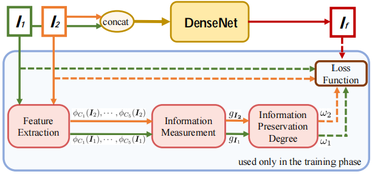

# U2Fusion: A Unified Unsupervised Image Fusion Network
- This is the PyTorch implementation of [U2Fusion: A Unified Unsupervised Image Fusion Network](https://ieeexplore.ieee.org/stamp/stamp.jsp?tp=&arnumber=9151265) (TPAMI 2020).
- The original paper can solve 3 typical image fusion tasks(multi-modal image fusion, multi-exposure image fusion and multi-focus image fusion), but in this repository, **only the multi-exposure image fusion branch** was implemented.



## 1. Environment
- Python >= 3.7
- PyTorch >= 1.4.0 is recommended
- opencv-python = 4.5.1
- matplotlib
- tensorboard
- pytorch_msssim

## 2. Dataset
The training data and testing data is from the [[SICE dataset]](https://github.com/csjcai/SICE "Official SICE").

## 3. Quick Demo
1. Clone this repository:
    ```
    git clone https://github.com/ytZhang99/U2Fusion-pytorch.git
    ```
2. Place the over-exposed images and under-exposed images in `dataset/test_data/over` and `dataset/test_data/under`, respectively.
3. Run the following command for multi-exposure fusion:
    ```
    python main.py --test_only
    ```
4. Finally, you can find the Super-resolved and Fused results in `./test_results`.

## 4. Training and Testing
1. Download the pre-trained vgg16 model from [VGG16](https://download.pytorch.org/models/vgg16-397923af.pth) and rename it to `vgg16.pth`. Place it in the same directory with `vgg.py`.
2. Place the training over-exposed images and under-exposed images in `dataset/train_data/over` and `dataset/train_data/under`, respectively.
3. Run the following command to train your own model:
```
python main.py --model mymodel.pth
```
Or you can fine-tune the existing model based on your own dataset:
```
python main.py --model model.pth
```
Moreover, if you want to test the model after training each epoch, run:
```
python main.py --model mymodel.pth --train_test
```
4. The generated model is placed in `./model/`, then you can test your model with:
```
python main.py --test_only --model mymodel.pth
```

## 5. Citation
The following paper might be cited:
```
@article{xu2020u2fusion,
  title={U2Fusion: A unified unsupervised image fusion network},
  author={Xu, Han and Ma, Jiayi and Jiang, Junjun and Guo, Xiaojie and Ling, Haibin},
  journal={IEEE Transactions on Pattern Analysis and Machine Intelligence},
  year={2020},
  publisher={IEEE}
}
```